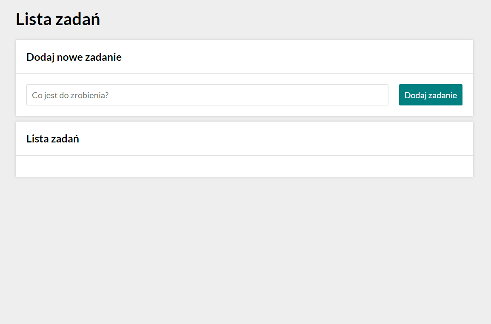

# *Task list*

## Demo

https://michalszustkiewicz.github.io/todo-list-react/

## Description

This application has been developed as a homework during realization of the course which I attend at [YouCode](https://youcode.pl/) programming school. Using this simple app you can create a list of tasks that need to be done. By clicking the green buttons on the left side you can mark which tasks have already been done and which are still to do. There is also an option to delete a specific task from the list. For this purpose, please click the red button on the right side of the task you want to remove. In case you have some problems, you can also find a little demonstration below. Hope it will be helpful for you.

##

## Languages and technologies

- HTML
- Flex, Grid
- styled components
- JavaScript (ES6+)
- Create React App (webpack, Babel)
- useState, useEffect, useRef, custom hooks

This project was bootstrapped with [Create React App](https://github.com/facebook/create-react-app).

## Available Scripts

In the project directory, you can run:

### `npm start`

Runs the app in the development mode.\
Open [http://localhost:3000](http://localhost:3000) to view it in your browser.

The page will reload when you make changes.\
You may also see any lint errors in the console.

### `npm run build`

Builds the app for production to the `build` folder.\
It correctly bundles React in production mode and optimizes the build for the best performance.

The build is minified and the filenames include the hashes.\
Your app is ready to be deployed!

See the section about [deployment](https://facebook.github.io/create-react-app/docs/deployment) for more information.

### `npm run eject`

**Note: this is a one-way operation. Once you `eject`, you can't go back!**

If you aren't satisfied with the build tool and configuration choices, you can `eject` at any time. This command will remove the single build dependency from your project.

Instead, it will copy all the configuration files and the transitive dependencies (webpack, Babel, ESLint, etc) right into your project so you have full control over them. All of the commands except `eject` will still work, but they will point to the copied scripts so you can tweak them. At this point you're on your own.

You don't have to ever use `eject`. The curated feature set is suitable for small and middle deployments, and you shouldn't feel obligated to use this feature. However we understand that this tool wouldn't be useful if you couldn't customize it when you are ready for it.
